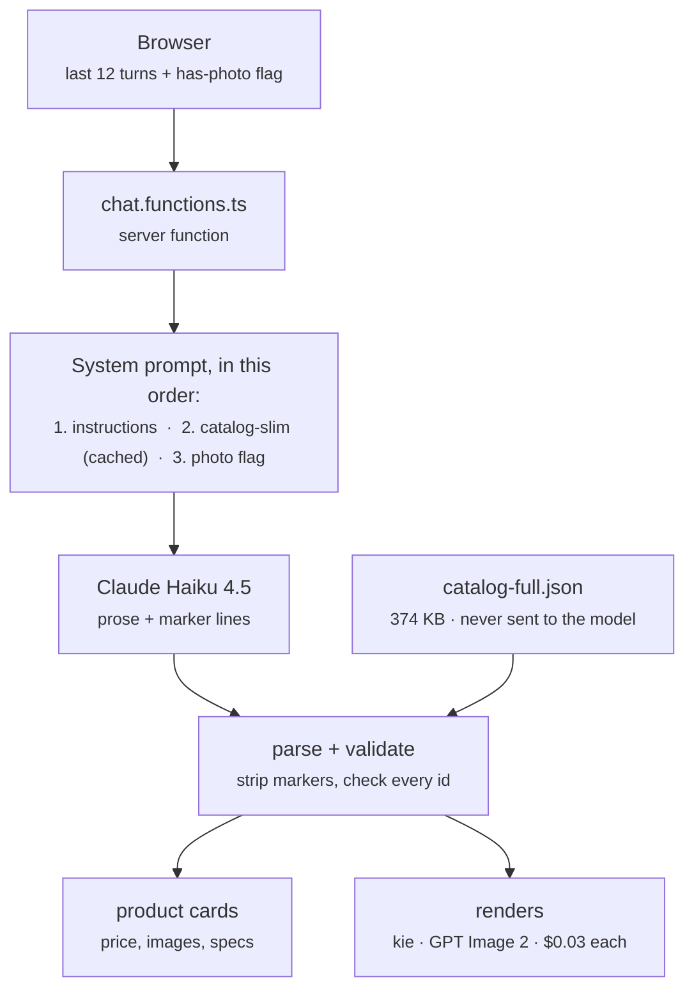
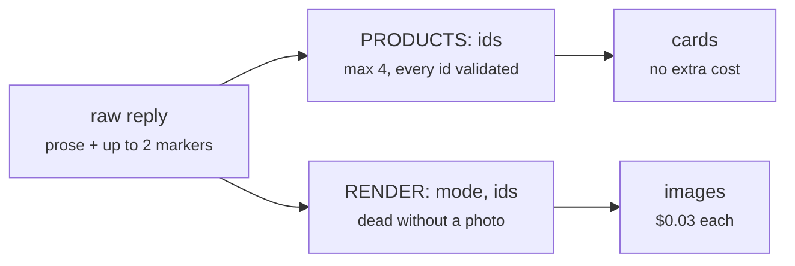

# Comfortel chatbot — how it works

A product-discovery chatbot for Comfortel, a salon/barber/spa furniture brand. A
customer describes the space they're fitting out, the assistant recommends real
SKUs as cards, and from any card they can either see the piece rendered into a
photo of their own salon or request a quote.

Two providers, doing different jobs:

- **Anthropic (Claude Haiku 4.5)** — the conversation and product selection.
- **kie.ai (`gpt-image-2-image-to-image`)** — the room renders. Nothing to do
  with Claude.

---

## 1. Request flow



The server function is the only thing that talks to Anthropic. No API call is
ever made from the browser, and no key reaches the client bundle.

---

## 2. Two catalogs, deliberately

This is the core design decision. There are two files and they exist for
opposite reasons.

| File                         | Size                     | Goes where                      | Contains                                          |
| ---------------------------- | ------------------------ | ------------------------------- | ------------------------------------------------- |
| `src/data/catalog-slim.json` | ~34 KB / **9.4k tokens** | into the system prompt          | `id, n, c, p, col, d, v` — ~168 chars per product |
| `src/data/catalog-full.json` | 374 KB                   | **client + server lookup only** | images, specs, dims, SKU, URL, stock, delivery    |

`v: 1` means the piece can be placed in a room photo (a chair, yes; a hydraulic
column, no).

**The model only ever sees the slim index.** Everything rich — the price on the
card, the image, the spec table — is looked up locally by id from
`catalog-full`. So the model's only job is to name ids, and a hallucinated price
is structurally impossible rather than merely discouraged.

`prep.js` (in the BE repo) generates both from the raw scrape. Its guiding rule
is worth preserving: never invent a value. A missing dimension is strictly
better than a guessed one, because a wrong dimension feeds straight into an
image prompt.

---

## 3. The system prompt

Three blocks, and **the order is load-bearing**:

```ts
system: [
  { type: "text", text: SYSTEM_INSTRUCTIONS }, // 1. stable rules
  {
    type: "text",
    text: CATALOG_BLOCK, // 2. 9.4k tokens
    cache_control: { type: "ephemeral" },
  }, //    ← cache breakpoint
  { type: "text", text: hasRoomPhoto ? "..." : "..." }, // 3. volatile
];
```

Prompt caching is a **prefix match**, so anything that changes between requests
must sit _after_ the `cache_control` breakpoint. The has-photo flag flips the
moment a customer attaches a photo; above the catalog block it would invalidate
the whole cached prefix and re-bill 9.4k tokens at write price. This was a real
bug during the build — caught before it shipped, hence the comment in the file.

Cost per reply with the cache warm:

|            | tokens | rate         | cost          |
| ---------- | ------ | ------------ | ------------- |
| cache read | 9,400  | $0.10 / MTok | $0.0009       |
| output     | ~150   | $5.00 / MTok | $0.0008       |
|            |        |              | **≈ $0.0017** |

For scale: **one render costs $0.03 — about eighteen chat replies.** The chat model
is rounding error next to image generation.

### What the instructions actually enforce

- **Show, don't narrate.** Never list model names or price ranges in prose —
  that's what the cards are for. "Show me everything" gets 3–4 representative
  pieces as cards, not a category summary.
- Never reply with only questions. Show a best guess, then ask the one
  refining question.
- Two or three sentences of prose. Light markdown, no headings, no emoji.
- Only surface component SKUs (bases, hydraulics, basins) when the customer is
  clearly shopping for a part.

---

## 4. The marker protocol

Haiku writes normal prose and appends up to two machine-readable lines. The
server pulls them out, strips them from the text, and acts on them.



```
[PRODUCTS: 330276, 330322, 8222]
[RENDER: lineup, 330276, 331349, 330353]
```

### The two guards that matter

**1. Every id is checked before it's trusted.**

```ts
if (trimmed && Object.prototype.hasOwnProperty.call(CATALOG_FULL, trimmed)) {
  ids.push(trimmed);
}
```

Unrecognised ids are dropped silently. Do not remove this.

**2. The regex is global and unanchored, on purpose.**

```ts
const PRODUCTS_MARKER = /\[PRODUCTS:\s*([^\]]*)\]/gi;
```

Haiku does sometimes emit more than one marker — one per category it grouped —
and sometimes puts one mid-line. An earlier single-match anchored version parsed
only the first, left the rest visible in the chat as raw text, and threw away
their ids. That shipped and was visible in the UI.

**Renders can spend money, so they're fenced:**

- hard cap of 4 renders per reply, enforced server-side, not just asked for
- the marker is not even parsed unless a photo is attached
- one render request per reply

---

## 5. Render modes and cost

One generation is **6 kie credits = $0.03** at 1K, measured from
`recordInfo.creditsConsumed`. A failed task consumes 0 — failures are free.

| Mode          | Images         | Cost      | Use for                                                             |
| ------------- | -------------- | --------- | ------------------------------------------------------------------- |
| `replace_all` | 1              | $0.03     | every matching piece becomes the SAME product                       |
| `lineup`      | 1              | $0.03     | 2–4 DIFFERENT products side by side, one per station, left to right |
| `refit_room`  | 1              | $0.03     | whole room refitted across furniture types                          |
| `add`         | 1              | $0.03     | drop one piece into free space                                      |
| `replace`     | **one per id** | $0.03 × n | true A/B — same position, each candidate in turn                    |

`replace` is the only mode that multiplies, and it has to: one image shows one
state of a room, so comparing candidates _in the same spot_ is inherently one
image each. The instructions tell the assistant to prefer `lineup` unless the
customer explicitly asks for like-for-like positioning.

**Fidelity trades against reference count.** One reference tracks the product
closely. Four, and the model treats them as a palette — `lineup` reliably
differentiates colour and finish but tends to converge the silhouettes;
`refit_room` is looser still. Steer anyone choosing between two frame _shapes_
to a single-product `replace`.

### The render call

```ts
model: "gpt-image-2-image-to-image"      // NO slash, unlike the 1.5 ids
input: {
  input_urls: [roomUrl, ...references],  // ORDER IS THE CONTRACT
  prompt, aspect_ratio,
  resolution,                            // "1K" by default
}
```

The room photo is first, product references after. The prompt refers to them
positionally ("image 3 shows it from the front"), so `buildRenderRequest()`
returns the prompt **and** the image array from one call — building them
separately invited exactly one bug, a prompt claiming a view the array didn't
contain.

### Product fidelity — why the model changed

The most-reported failure was never the room, it was the product: right salon,
wrong chair. Armrests squared off, a five-star base rendered as a disc.

Rendering the same salon photo through both models found the cause, and it was
not the prompt. **`gpt-image/1.5-image-to-image` does not replace furniture, it
re-skins it.** Asked to fit a black Comfortel chair into a room of chrome barber
chairs, it recoloured the existing chairs black and kept their frames, bases,
footrests and headrests. Stating "do NOT recolour or reupholster what is already
there — that is a FAILED render" verbatim in the prompt did not change it.

**GPT Image 2 does replace them**, and preserves the room, the chair count and
each station's facing while doing it. That is the whole reason for the switch.
It also lifts the two limits that shaped this code:

| | gpt-image/1.5 | GPT Image 2 |
| --- | --- | --- |
| prompt limit | 3000 chars (hard reject) | 20000 documented, 6000 verified |
| reference images | effectively few | 16 |
| sizing | `quality: medium\|high` | `resolution: 1K\|2K\|4K` |
| fetches `comfortelfurniture.com` | yes | **no — must be mirrored** |

`referenceViews()` sends up to **four** views of the same product — the hero shot
plus any explicit front/side/back photograph — so the model can see the armrest
profile and the base instead of inferring them from one 3/4 angle. Lifestyle
shots are skipped: a photo of the chair already standing in another salon
competes with "the first image is the salon".

### Product images must be mirrored

GPT Image 2 cannot fetch `comfortelfurniture.com` — it fails the whole task with
"Image fetch failed. Check access settings or use our File Upload API instead."
1.5 could, which is why this only surfaced on the switch. `mirrorAll()` in
`kie.server.ts` downloads each reference and re-uploads it to kie's own storage,
concurrently, with a short in-memory TTL cache. The room photo already went
through that upload path; product references now do too.

### Mirrors — reflections are handled

A salon is a wall of mirrors, so most furniture appears twice: once as itself and
again in every mirror that can see it. Half of those copies were going unedited,
leaving the customer's old chair standing in every reflection.

The fix is a framing, and the framing is the whole trick. Three attempts:

| Instruction | Result |
| --- | --- |
| "rebuild the floor, skirting and wall behind it" (original — no mention of mirrors) | old chair left standing in every mirror |
| "mirrors are part of this REMOVAL — remove all those copies" | stale reflections gone, mirrors left **empty** |
| "treat each reflected ${subject} as ANOTHER ONE TO REPLACE" | **reflections show the new product** |

Telling the model to *clear* a reflection gets it cleared and not repainted.
Telling it the reflection is simply another instance of the thing being replaced
puts it inside the operation the model is already good at, and the mirror comes
back correct — including from a different angle than the camera sees.

The clause names both failure modes explicitly, because each was a real
observed output: a mirror still showing the old unit, and a mirror emptied of a
chair that is still standing in front of it.

Worth knowing: these models do not compute reflection geometry, they duplicate.
Generated *fixtures* show the same tell — ask for a salon whose mirrors reflect
the chairs and you get the chair's rear view in the mirror when the chair's back
is to the camera, which is physically impossible. The replace framing works
anyway because it never asks the model to reason about geometry.

### Single-unit replacement is approximate — `replace_all` is the default

`replace_all` has been correct in every live test: right product, right count,
facings kept, mirrors consistent with the floor. Swapping a **single** unit in a
room containing several identical ones has never been reliable.

Four prompt formulations were tried against the same three-chair fixture, each
more specific than the last:

| Wording | What the render did |
| --- | --- |
| "remove only the one nearest the camera" | replaced every chair in the room |
| hard count: "exactly ONE changes" | deleted the two it was told to leave |
| + "mirror scope follows floor scope" | changed the wrong chair, left reflections stale |
| + spatial "FOREGROUND" anchor | still wrong |

The task is instance tracking — pick one of several identical objects and edit
only it, and only its reflection. Image models do not do that from prose. The
industry answer is a **mask**, and kie exposes none: `gpt-image-2-image-to-image`
takes only `prompt`, `input_urls`, `aspect_ratio` and `resolution`. A `mask` field
is not rejected, it is silently ignored, which is the worst failure mode.

So the product stops fighting it. `replace_all` is the default in the dialog, in
the chat marker fallback, and in the server validator. Single swap is offered
last and labelled "Approximate — with several in view it may change a different
one". The prompt keeps one plain sentence instead of the four failed stacked
clauses; a test asserts the dead wordings do not come back.

**If single-unit precision is needed later**, the fix is spatial input, not more
words: have the customer tap the unit, crop that region client-side, render the
crop alone (one unit in frame means nothing to disambiguate), and composite it
back. The client already does canvas work in `resize-image.ts`.

### Every copy is the same model

Pinning count and facing said nothing about the copies matching *each other*, so
each position became a fresh interpretation of the references and the chairs
drifted apart. The prompt now states that all instances are one model, identical
in silhouette, arms, base, seams and finish, differing **only** in size, angle
and position.

**Count is still not perfectly reliable.** Across three renders of the same
three-station fixture, two kept three chairs and one produced four, despite the
prompt pinning the count both in the install step and in the closing check.
Treat exact count as likely, not guaranteed.

### The prompt budget

`assemble()` in `visualize-prompt.ts` caps every prompt at `MAX_PROMPT_CHARS` and
drops whole clauses in an explicit `DROP` priority order when over — never
truncating mid-sentence, which would leave a dangling instruction.

This exists because of a real outage. Adding the fidelity clauses pushed the
`replace` prompt from 2432 to 3080 characters, past 1.5's hard 3000-char limit
(measured: 3000 accepted, 3001 rejected). kie rejected `createTask` outright, so
**every** render failed instantly, for free, with a message that never mentioned
length. `replace` is the default mode, which is why it looked like "everything is
broken". Nothing enforced the limit, so a wording change could silently break
rendering — now it cannot.

**Coverage — and where it actually stopped.** Two separate limits were confused
here for a long time.

The first was a cap in the classifier: `MAX_IMAGES` was **6**, so any listing
with more photos than that had its tail ignored. Harper Styling Chair carries 14
images and its clean front, side and back shots sit at positions 12, 14 and 10 —
behind six base-and-hydraulic variants and two lifestyle features. The classifier
saw six, correctly rejected all six, returned nothing, and the best angle set in
the catalogue went unused. Across 64 products, **289 photographs had never once
been looked at**. The cap is now 14 (`CLASSIFY_MAX_IMAGES` overrides it).

The second was assumed and is **false**: scraping the vendor site for more photos
gains nothing. Checked by curl and by rendering the pages in a browser —
`data-large_image` is the gallery's only real source, the thumbnails are
client-side Underscore templates, and there is no variation-gallery JSON. Blake
Merlot, Oakley and Cloud Waiting Sofa show **one** photograph on the page, which
is the one we already hold; Harper shows 14, which are the 14 we already hold.
`catalog-full.json` is already complete against the vendor. Don't re-run a
scraper expecting more.

What the photography genuinely cannot give: **Archie Styling Chair** has 8
photos, all the same 3/4 angle in different base finishes. **Hazel** and **Zippy**
are sold with a black basin but every extra angle in their listings shows the
white-basin variant, so they are hero-only on purpose. Twenty-three renderable
products have exactly one photograph on file and always will.

Two rules the automated pass got wrong, both fixed by hand:

- **The hero need not be image 1.** Walker, Taylor, Maverick and Willow reception
  desks all lead with a lifestyle shot, so the "hero must be image 1" rule binned
  four complete studio sets. Anchor on the first clean single-unit studio shot
  instead.
- **Filenames lie about variants.** Harper `#11` and `#13` are both named
  `Black-Pump`; `#11` has a chrome column and `#13` a black one. Only `#13`
  matches the anchor. Judge the pixels.

Three kie traps, all commented in `kie.server.ts`:

1. Don't branch on `json.code` — kie returns `505` alongside `msg: "success"`.
   Branch on `data.state` (`waiting | queuing | generating | success | fail`).
2. `resultJson` is a JSON **string**, not an object.
3. kie can't always fetch arbitrary remote images — it wants its own upload API.
   The room photo goes through `file-base64-upload` first.

The browser drives polling (3s interval, 40 attempts). Never poll in a
server-side loop.

### Prompt engineering for the removal step

These models soft-pedal deletion: asked to "replace" a chair they'll often add
the new one and leave the old one beside it. So removal is stated three times,
in the positions the model weights most:

1. as its own numbered step, first
2. with explicit instruction to rebuild the floor and wall behind
3. as an acceptance check at the very end — "the original must not appear
   anywhere in the frame, not beside it, not in addition to it"

---

## 6. Client-side flow

The customer can attach a photo two ways, and both land in the same place:

- the image button in the composer — becomes the session's room photo, so later
  turns can render into it without re-uploading
- "See it in my space" on any card, which opens the mode picker

Photos are resized client-side to a 1024px longest edge as JPEG q0.85 **before
they ever leave the browser**. Full-resolution phone photos never hit the wire.

Renders land in the chat transcript, not a modal. A single render gets the full
column width; several go in a scroll rail so they can be compared. Clicking any
one opens a full-screen lightbox with a before/after toggle bound to the arrow
keys, and a download button.

The transcript persists in `sessionStorage` so a reload doesn't lose a demo.
Room photos and in-flight renders are deliberately excluded from that copy —
photos are megabyte-scale data URLs and would blow the quota, and an unfinished
render can't be resumed anyway.

---

## 7. Error codes

Every failure used to collapse to `CHAT_FAILED`, which made a missing key on a
deployed host indistinguishable from a network fault — two problems with
completely different fixes. Now:

| Code                       | Means                                    |
| -------------------------- | ---------------------------------------- |
| `CHAT_NOT_CONFIGURED`      | `ANTHROPIC_API_KEY` absent on the server |
| `CHAT_KEY_REJECTED`        | 401/403 — key expired or out of credit   |
| `CHAT_RATE_LIMITED`        | 429                                      |
| `CHAT_UPSTREAM_ERROR`      | Anthropic returned something else        |
| `CHAT_FAILED`              | anything else                            |
| `VISUALIZE_NOT_CONFIGURED` | `KIE_API_KEY` absent                     |

None of them expose a key, a URL, or an upstream body. The UI maps each to
distinct copy so whoever is testing can self-diagnose.

---

## 8. Environment variables

| Name                            | Needed by              | Without it                            |
| ------------------------------- | ---------------------- | ------------------------------------- |
| `ANTHROPIC_API_KEY`             | server                 | chat dead                             |
| `KIE_API_KEY`                   | server                 | renders dead                          |
| `KIE_IMAGE_RESOLUTION`          | server, optional       | defaults to `1K` (`2K`/`4K` cost more) |
| `SUPABASE_SERVICE_ROLE_KEY`     | server                 | quote requests fail; render cache off |
| `SUPABASE_URL`                  | server                 | as above                              |
| `VITE_SUPABASE_URL`             | client, **build time** | see below                             |
| `VITE_SUPABASE_PUBLISHABLE_KEY` | client, **build time** | see below                             |

**The `VITE_` pair is inlined at build time.** A build that ran without them
ships `undefined` — no runtime setting can recover it, only a rebuild. This
bricked the first deploy: the page rendered fine, then every click threw
`Missing Supabase environment variable(s)` client-side, because the generated
`attachSupabaseAuth` middleware runs on _every_ server-function call from the
browser and touches the Supabase client.

`src/lib/supabase-auth-middleware.ts` is a guarded stand-in for that middleware.
This app has no sign-in, so "no session" is a normal state rather than an error:
it attaches a bearer token when Supabase is configured and proceeds
unauthenticated when it isn't. Chat and renders now work with no Supabase at
all; only quote requests degrade. Deliberately a new file rather than a patch to
`auth-attacher.ts`, which is generated and would be overwritten.

Also note: on Vercel and Lovable alike, env vars only apply to deployments built
**after** they were added. Adding a key to a live deployment changes nothing
until you redeploy — the same trap as editing `.env` without restarting Vite.

---

## 9. Database

| Table            | Written by               | Notes                                                                  |
| ---------------- | ------------------------ | ---------------------------------------------------------------------- |
| `visualizations` | `visualize.functions.ts` | render cache, keyed `sha256(ids + mode + photo)`                       |
| `enquiries`      | `enquiry.functions.ts`   | quote requests, with the customer's render attached when they made one |

Both have RLS enabled with **no policy**, deliberately: they're reached only
through the service role in server functions, so no anon client can read another
customer's contact details. The linter flag on this is expected.

The cache is an optimisation, not a dependency — reads and writes are
best-effort, so a Supabase outage makes a render slow rather than impossible.
But while it's off, every repeat of the same photo + products + mode bills again.

---

## 10. File map

| File                             | Job                                                 |
| -------------------------------- | --------------------------------------------------- |
| `src/lib/chat.functions.ts`      | system prompt, Anthropic call, marker parsing       |
| `src/lib/catalog.ts`             | catalog access, USD formatting, category labels     |
| `src/lib/visualize.functions.ts` | render orchestration, cache, polling                |
| `src/lib/visualize-prompt.ts`    | the image prompts, one builder per mode             |
| `src/lib/kie.server.ts`          | the only place that talks to kie                    |
| `src/lib/resize-image.ts`        | client-side downscale before upload                 |
| `src/lib/enquiry.functions.ts`   | quote requests                                      |
| `src/lib/layout.ts`              | station geometry: clearances, capacity arithmetic    |
| `src/lib/room.ts`                | typed room dimensions, units, the planner's message  |
| `src/lib/whatsapp.ts`            | WhatsApp platform limits and which primitive fits    |
| `src/routes/index.tsx`           | the chat page, message model, render dispatch       |
| `src/components/WhatsAppView.tsx`| the WhatsApp Mode preview surface                   |
| `src/components/`                | cards, sheets, dialogs, lightbox, markdown renderer |

`src/integrations/supabase/*` is generated by Lovable — don't hand-edit it,
except `types.ts` when a table is added.

---

## 11. Render QA

Every finished render is inspected before the customer sees it, and re-run once
if something basic is broken. `render-qa.ts` holds the taxonomy and the retry
decision; `render-qa.functions.ts` is the vision call.

Haiku 4.5, not Sonnet: this runs per image rather than per session, and the job
is narrow — "is anything unmistakably broken" against a fixed list. Measured at
~2,400 input and ~120 output tokens, about $0.003 a check, a tenth of the render
it is protecting.

Six faults are worth a retry, all physical: `intersecting`, `floating`,
`stale_mirror`, `duplicate_mismatch`, `leftover`, `deformed`. Taste is
deliberately excluded — a taxonomy that included "the colour feels cold" would
fire constantly and burn a $0.03 render each time.

The bias is towards passing. A missed fault shows one imperfect image; a phantom
fault costs a render and another 90 seconds to produce nothing better. The prompt
says so explicitly, and calls out that partial occlusion is normal and is not
intersecting.

Three things that matter if you touch this:

- **The correction is part of the render cache key.** Without it a retry hashes
  identically to the attempt it is retrying, hits the cache, and serves back the
  exact image the inspector just rejected.
- **The correction is a required prompt clause, not a suffix.** Appending it
  after assembly could push past `MAX_PROMPT_CHARS`, which is the limit that once
  silently broke every render. Measured headroom with a correction attached:
  4,412 of 6,000 on the longest mode.
- **One retry, never more.** Each is real money and another 80-98 seconds of
  waiting. A second failure usually means the room or the request is the problem.

Failure to inspect is never failure to deliver: no key, an API error, a malformed
reply, an unreachable image all return a pass. The customer sees a render that
took slightly longer, never an error about our retry logic.

The first line of defence is still the prompt. `realismClauses()` gained an
explicit solidity rule after a chair was rendered half-buried in a timber wall
panel — these models place plausibly but model no collision, so it has to be
stated as a rule about solid objects rather than implied by "photorealistic".

---

## 12. The guided flows

The three starters on the first screen do not send a sentence to the model any
more. Each opens `PlanWizard`, which gathers the requirement first, shows what it
understood, and only then recommends — the order guided selling works in.

All three converge on `src/lib/packages.ts`, because "describe my salon", "here
is my budget" and "here are my dimensions" are the same question underneath:
which pieces, how many, what total. Computing it here rather than asking the
model means real prices, correct arithmetic, and the same answer every time.

| Starter            | Asks for                          | Ends with                    |
| ------------------ | --------------------------------- | ---------------------------- |
| A whole salon      | free text; count and budget parsed | three packages               |
| To a budget        | budget + station count            | three packages               |
| Plan by dimensions | wall, depth, budget               | three packages, then zone renders |

### Curation: the model picks, code counts

`curate.functions.ts` asks Sonnet 5 to choose the pieces; `curate.ts` verifies
and prices them. Sonnet rather than Haiku because this reads ~80 candidates
across seven roles, holds a budget and keeps a look coherent — a different order
of task from picking four chairs for a chat reply. It runs once or twice a
session, so the tier costs pennies.

The model chooses roles, quantities and specific products, and writes the
rationale. It never writes a number: totals are computed from the catalogue
afterwards, so the sentence carrying a price is always true because nothing
generated it. `adopt()` rejects invented ids, products placed in roles they
cannot fill, absurd quantities, and any package without styling chairs.

Four things this cost to get right, all worth knowing before touching it:

- **`strict: true` is not optional.** Without it the model returned `packages` as
  a JSON *string* containing another `{"packages": [...]}` object, and
  `Array.isArray` quietly failed. `readPackages()` still tolerates that shape.
- **Strict accepts a narrow JSON Schema subset.** `minItems` above 1 and
  `minimum`/`maximum` on numbers are both rejected with a 400. Bounds live in
  `adopt()` instead.
- **A model that cannot see prices cannot hit a budget.** Prices were withheld at
  first so no figure could be misquoted; every tier came back at a third of the
  budget. It sees prices now and is told never to write one.
- **It still under-spends, so `fitToBand()` finishes the job.** Hitting a total is
  arithmetic across seven roles and quantities, which is the thing models are
  worst at. The model's composition and style stay fixed; only the product within
  each role climbs, preferring the package's dominant collection.

Tier labels are assigned from the final sorted totals, not from what the model
called them — band-fitting moves each package by a different amount, which once
produced a "Stretch" that was the cheapest of the three.

Everything falls back to the deterministic packer: no key, rate limit, malformed
proposal, or fewer than three surviving packages. The wizard seeds with it
immediately, so the step is never empty while the request is out.

### Packages

`needsFor(stations)` is the fit-out: a chair, mirror and stool per station, a
backwash per three chairs, a trolley per two, one reception desk, one waiting
piece. `buildPackages(budget, needs)` returns three — 0.85x, 1.0x and 1.25x the
budget — each the best buildable at its number.

Two things the allocator learned the hard way:

- **Allocate by share, not by cheapest upgrade.** Upgrading a $159 stool is
  cheap, so a naive greedy loop climbed stools, trolleys and mirrors to the top
  of their ranges before the chairs moved at all, and recommended $5,908 of
  mirrors against $2,396 of chairs. `SHARE` fixes the proportions; `OVERRUN`
  stops leftover money funnelling into one role.
- **Price floors are not enough to tell furniture from hardware.** `shampoo_unit`
  holds a $12 shower hose, `mirror_unit` holds a $749 joiner frame. The floor
  catches the cheap end, the `ACCESSORY` pattern catches the rest.

Reasons are derived, never written. People judge options against each other far
better than in isolation, so each tier names the single biggest concrete
difference from the middle one — this chair rather than that chair — plus what
does not change. No tier is a decoy: every one is genuinely the most the
catalogue gives at its price, which is the failure mode tiered pricing usually
falls into.

The plan carries quantities (`planQty`) purely so the tray's subtotal matches the
package. Renders still use one reference image per product.

---

## 13. WhatsApp Mode

A toggle in the header re-renders the same transcript as WhatsApp would deliver
it. It is a feasibility preview, not a theme: the point is to answer "does this
survive being a WhatsApp bot?", and that is decided by platform limits, so the
view is held to them and annotates what would be cut.

Limits encoded in `src/lib/whatsapp.ts`, from Meta's Cloud API docs (Aug 2026):

| Primitive              | Cap                                       |
| ---------------------- | ----------------------------------------- |
| Reply buttons          | 3 per message, 20-char labels             |
| List message           | 10 rows total, 24-char titles, 72-char descriptions |
| Multi-product message  | 30 products, needs a synced Meta catalogue |
| Body / footer          | 1024 / 60 characters                      |

`carrierFor(n)` picks the primitive a set of products actually needs, so the
annotation cannot claim a list holds 30 or that a catalogue message cuts rows.

### The scripted menu

`src/lib/wa-flow.ts` is the deterministic front half, and it answers first. A
business number does not send every "Hi" to a language model: it replies from a
script, instantly, for free, and still works when the API is down or out of
credit. Only a sentence the menu cannot serve falls through to `runChat`.

    Hi              -> welcome + 3 reply buttons
    Browse the range-> list message, 10 categories
    <category>      -> that category's products, straight from the catalogue
    Plan my space   -> asks for the wall, then hands the measurement to layout.ts
    Talk to a person-> handoff notice

`advance()` returns `null` to mean "the menu has nothing to add" — that is the
signal to call the model. It is pure, so the whole tree is testable without a
network.

Menus are tappable, not "reply 1 for styling chairs". Numbered text menus are
the legacy pattern and interactive buttons measurably outperform them, but typed
digits are still accepted because people type at menus regardless.

What maps cleanly: the 3-mode picker onto 3 reply buttons; a 10-piece plan onto
exactly one list message (`MAX_REFERENCES` is 10, which is also the list cap —
raising it silently forces the heavier catalogue path); the 80-98s render onto a
medium where waiting is normal rather than a spinner.

What does not survive: the product carousel, the plan tray with its live
subtotal, and the before/after slider. Those are web-only affordances.

Not encodable, and the real risks:

- **Policy.** Meta banned general-purpose AI assistants in January 2026.
  Task-specific sales and support bots remain allowed, which this is — but it
  has to be scoped and presented as a Comfortel sales assistant, not a general
  assistant.
- **State.** Conversation state currently lives in React and `sessionStorage`.
  WhatsApp is stateless per message, so a real build needs a server-side session
  keyed by phone number. This is the largest rewrite.
- **Media.** kie serves renders from an expiring tempfile CDN. WhatsApp needs a
  durable URL or an upload, so renders must be persisted first, and converted to
  JPEG against the 5 MB send limit.
- **Cost.** Service messages inside the 24-hour window are free today but start
  being charged on 1 October 2026, on top of the ~$0.03 per render.

The palette is WhatsApp's own current in-app one (`#008069` header, `#efeae2`
wallpaper, `#d9fdd3` outgoing, `#005c4b`/`#202c33` in dark), not the legacy brand
palette (`#dcf8c6`, `#ece5dd`) that colour-listing sites still publish.

---

## Known gaps

- The assistant doesn't distinguish "choosing between colours" (use `lineup`)
  from "choosing between frame shapes" (use `replace`). It reaches for `lineup`
  either way.
- Some product image URLs may not be fetchable by kie, which would make those
  products' renders always fail. Not swept across all 202.
- Product thumbnails intermittently fail to load. Investigated: the URLs are
  correct and serve fine cross-origin, 12 concurrent, from localhost and from a
  public origin. The failures tracked observed `ERR_NAME_NOT_RESOLVED` /
  `ERR_NETWORK_CHANGED` in the console, so the cause looks like the network
  rather than the data. Both `ProductCard` and `PlanTray` now degrade to an icon
  instead of a broken-image glyph, but the underlying flakiness is unexplained.
- WhatsApp Mode has no session store. The scripted menu is real and tappable,
  but its state lives in React like everything else, so a real build still needs
  a server-side session keyed by phone number.
- The scripted menu covers browse, plan and handoff. Anything else falls through
  to the model, so an API outage degrades to "menu works, conversation doesn't"
  rather than failing outright.
- 92 of the 126 renderable products have only one product photograph, so their
  renders can't be held to the reference the way a multi-view product can.
- `catalog-full.json` ships to the browser whole, including shipping-carton
  specs that are filtered out at display time. ~60 KB gzipped of dead weight.
