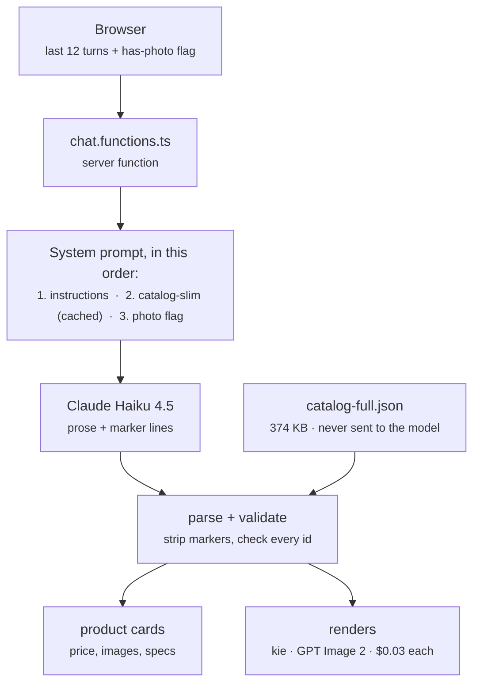
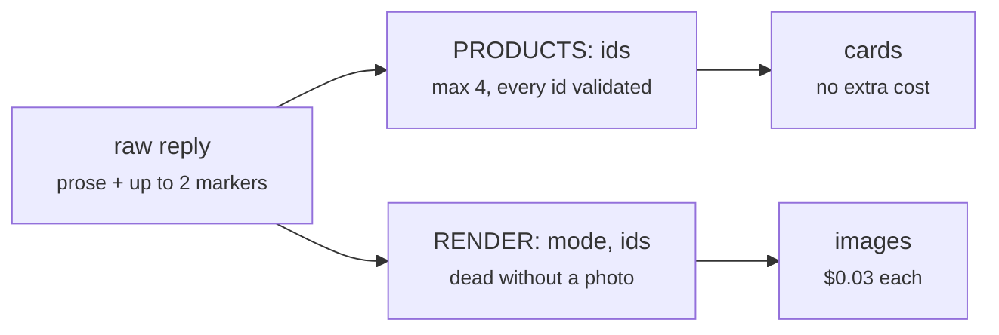

# Comfortel chatbot — how it works

A product-discovery chatbot for Comfortel, a salon/barber/spa furniture brand. A
customer describes the space they're fitting out, the assistant recommends real
SKUs as cards, and from any card they can either see the piece rendered into a
photo of their own salon or request a quote.

Two providers, doing different jobs:

- **Anthropic (Claude Haiku 4.5)** — the conversation and product selection.
- **kie.ai (`gpt-image-2-image-to-image`)** — the room renders. Nothing to do
  with Claude.

---

## 1. Request flow



The server function is the only thing that talks to Anthropic. No API call is
ever made from the browser, and no key reaches the client bundle.

---

## 2. Two catalogs, deliberately

This is the core design decision. There are two files and they exist for
opposite reasons.

| File                         | Size                     | Goes where                      | Contains                                          |
| ---------------------------- | ------------------------ | ------------------------------- | ------------------------------------------------- |
| `src/data/catalog-slim.json` | ~34 KB / **9.4k tokens** | into the system prompt          | `id, n, c, p, col, d, v` — ~168 chars per product |
| `src/data/catalog-full.json` | 374 KB                   | **client + server lookup only** | images, specs, dims, SKU, URL, stock, delivery    |

`v: 1` means the piece can be placed in a room photo (a chair, yes; a hydraulic
column, no).

**The model only ever sees the slim index.** Everything rich — the price on the
card, the image, the spec table — is looked up locally by id from
`catalog-full`. So the model's only job is to name ids, and a hallucinated price
is structurally impossible rather than merely discouraged.

`prep.js` (in the BE repo) generates both from the raw scrape. Its guiding rule
is worth preserving: never invent a value. A missing dimension is strictly
better than a guessed one, because a wrong dimension feeds straight into an
image prompt.

---

## 3. The system prompt

Three blocks, and **the order is load-bearing**:

```ts
system: [
  { type: "text", text: SYSTEM_INSTRUCTIONS }, // 1. stable rules
  {
    type: "text",
    text: CATALOG_BLOCK, // 2. 9.4k tokens
    cache_control: { type: "ephemeral" },
  }, //    ← cache breakpoint
  { type: "text", text: hasRoomPhoto ? "..." : "..." }, // 3. volatile
];
```

Prompt caching is a **prefix match**, so anything that changes between requests
must sit _after_ the `cache_control` breakpoint. The has-photo flag flips the
moment a customer attaches a photo; above the catalog block it would invalidate
the whole cached prefix and re-bill 9.4k tokens at write price. This was a real
bug during the build — caught before it shipped, hence the comment in the file.

Cost per reply with the cache warm:

|            | tokens | rate         | cost          |
| ---------- | ------ | ------------ | ------------- |
| cache read | 9,400  | $0.10 / MTok | $0.0009       |
| output     | ~150   | $5.00 / MTok | $0.0008       |
|            |        |              | **≈ $0.0017** |

For scale: **one render costs $0.03 — about eighteen chat replies.** The chat model
is rounding error next to image generation.

### What the instructions actually enforce

- **Show, don't narrate.** Never list model names or price ranges in prose —
  that's what the cards are for. "Show me everything" gets 3–4 representative
  pieces as cards, not a category summary.
- Never reply with only questions. Show a best guess, then ask the one
  refining question.
- Two or three sentences of prose. Light markdown, no headings, no emoji.
- Only surface component SKUs (bases, hydraulics, basins) when the customer is
  clearly shopping for a part.

---

## 4. The marker protocol

Haiku writes normal prose and appends up to two machine-readable lines. The
server pulls them out, strips them from the text, and acts on them.



```
[PRODUCTS: 330276, 330322, 8222]
[RENDER: lineup, 330276, 331349, 330353]
```

### The two guards that matter

**1. Every id is checked before it's trusted.**

```ts
if (trimmed && Object.prototype.hasOwnProperty.call(CATALOG_FULL, trimmed)) {
  ids.push(trimmed);
}
```

Unrecognised ids are dropped silently. Do not remove this.

**2. The regex is global and unanchored, on purpose.**

```ts
const PRODUCTS_MARKER = /\[PRODUCTS:\s*([^\]]*)\]/gi;
```

Haiku does sometimes emit more than one marker — one per category it grouped —
and sometimes puts one mid-line. An earlier single-match anchored version parsed
only the first, left the rest visible in the chat as raw text, and threw away
their ids. That shipped and was visible in the UI.

**Renders can spend money, so they're fenced:**

- hard cap of 4 renders per reply, enforced server-side, not just asked for
- the marker is not even parsed unless a photo is attached
- one render request per reply

---

## 5. Render modes and cost

One generation is **6 kie credits = $0.03** at 1K, measured from
`recordInfo.creditsConsumed`. A failed task consumes 0 — failures are free.

| Mode          | Images         | Cost      | Use for                                                             |
| ------------- | -------------- | --------- | ------------------------------------------------------------------- |
| `replace_all` | 1              | $0.03     | every matching piece becomes the SAME product                       |
| `lineup`      | 1              | $0.03     | 2–4 DIFFERENT products side by side, one per station, left to right |
| `refit_room`  | 1              | $0.03     | whole room refitted across furniture types                          |
| `add`         | 1              | $0.03     | drop one piece into free space                                      |
| `replace`     | **one per id** | $0.03 × n | true A/B — same position, each candidate in turn                    |

`replace` is the only mode that multiplies, and it has to: one image shows one
state of a room, so comparing candidates _in the same spot_ is inherently one
image each. The instructions tell the assistant to prefer `lineup` unless the
customer explicitly asks for like-for-like positioning.

**Fidelity trades against reference count.** One reference tracks the product
closely. Four, and the model treats them as a palette — `lineup` reliably
differentiates colour and finish but tends to converge the silhouettes;
`refit_room` is looser still. Steer anyone choosing between two frame _shapes_
to a single-product `replace`.

### The render call

```ts
model: "gpt-image-2-image-to-image"      // NO slash, unlike the 1.5 ids
input: {
  input_urls: [roomUrl, ...references],  // ORDER IS THE CONTRACT
  prompt, aspect_ratio,
  resolution,                            // "1K" by default
}
```

The room photo is first, product references after. The prompt refers to them
positionally ("image 3 shows it from the front"), so `buildRenderRequest()`
returns the prompt **and** the image array from one call — building them
separately invited exactly one bug, a prompt claiming a view the array didn't
contain.

### Product fidelity — why the model changed

The most-reported failure was never the room, it was the product: right salon,
wrong chair. Armrests squared off, a five-star base rendered as a disc.

Rendering the same salon photo through both models found the cause, and it was
not the prompt. **`gpt-image/1.5-image-to-image` does not replace furniture, it
re-skins it.** Asked to fit a black Comfortel chair into a room of chrome barber
chairs, it recoloured the existing chairs black and kept their frames, bases,
footrests and headrests. Stating "do NOT recolour or reupholster what is already
there — that is a FAILED render" verbatim in the prompt did not change it.

**GPT Image 2 does replace them**, and preserves the room, the chair count and
each station's facing while doing it. That is the whole reason for the switch.
It also lifts the two limits that shaped this code:

| | gpt-image/1.5 | GPT Image 2 |
| --- | --- | --- |
| prompt limit | 3000 chars (hard reject) | 20000 documented, 6000 verified |
| reference images | effectively few | 16 |
| sizing | `quality: medium\|high` | `resolution: 1K\|2K\|4K` |
| fetches `comfortelfurniture.com` | yes | **no — must be mirrored** |

`referenceViews()` sends up to **four** views of the same product — the hero shot
plus any explicit front/side/back photograph — so the model can see the armrest
profile and the base instead of inferring them from one 3/4 angle. Lifestyle
shots are skipped: a photo of the chair already standing in another salon
competes with "the first image is the salon".

### Product images must be mirrored

GPT Image 2 cannot fetch `comfortelfurniture.com` — it fails the whole task with
"Image fetch failed. Check access settings or use our File Upload API instead."
1.5 could, which is why this only surfaced on the switch. `mirrorAll()` in
`kie.server.ts` downloads each reference and re-uploads it to kie's own storage,
concurrently, with a short in-memory TTL cache. The room photo already went
through that upload path; product references now do too.

### Mirrors — what works and what does not

A salon is a wall of mirrors, so most furniture appears twice: once as itself and
again in every mirror that can see it. Half of those copies were going unedited.

**Fixed.** Removal now covers mirrors explicitly. The old instruction said to
rebuild "the floor, skirting and wall behind" each unit and never mentioned
reflections, so the old chair was deleted from the room and left standing in the
mirror. Stating that mirrors are part of the removal clears them.

**Not fixed, and not fixable by prompting.** Getting the model to *draw* a
reflection of the inserted piece does not work. Two instructions were tested
live — "show that piece from the angle that mirror sees" and an explicit "a
mirror shows the OPPOSITE side to the camera; reproducing the camera's view
inside the mirror is a duplicate, not a reflection" — and both were ignored,
leaving the mirrors simply empty. These models duplicate rather than reflect;
there is no mirror geometry to instruct. The same fault is visible in generated
*fixtures*: ask for a salon whose mirrors reflect the chairs and you get the
chair's rear view in the mirror when the chair's back is to the camera, which is
physically impossible.

So the shipped behaviour is: **no stale product in a mirror, but no reflection of
the new one either.** An empty mirror is wrong, just less wrong than a mirror
reflecting a chair the customer no longer owns. Only the clause that measurably
changes the output is kept — dead prompt text is a liability, not insurance.

### Every copy is the same model

Pinning count and facing said nothing about the copies matching *each other*, so
each position became a fresh interpretation of the references and the chairs
drifted apart. The prompt now states that all instances are one model, identical
in silhouette, arms, base, seams and finish, differing **only** in size, angle
and position.

**Count is still not perfectly reliable.** Across three renders of the same
three-station fixture, two kept three chairs and one produced four, despite the
prompt pinning the count both in the install step and in the closing check.
Treat exact count as likely, not guaranteed.

### The prompt budget

`assemble()` in `visualize-prompt.ts` caps every prompt at `MAX_PROMPT_CHARS` and
drops whole clauses in an explicit `DROP` priority order when over — never
truncating mid-sentence, which would leave a dangling instruction.

This exists because of a real outage. Adding the fidelity clauses pushed the
`replace` prompt from 2432 to 3080 characters, past 1.5's hard 3000-char limit
(measured: 3000 accepted, 3001 rejected). kie rejected `createTask` outright, so
**every** render failed instantly, for free, with a message that never mentioned
length. `replace` is the default mode, which is why it looked like "everything is
broken". Nothing enforced the limit, so a wording change could silently break
rendering — now it cannot.

**Coverage is the remaining limit.** Of the 126 renderable products, only **34**
have more than one usable view; the other **92** ship a single photograph, and
for those this fix changes nothing. Scraping additional angles into
`catalog-full.json` is the highest-value data work left.

Three kie traps, all commented in `kie.server.ts`:

1. Don't branch on `json.code` — kie returns `505` alongside `msg: "success"`.
   Branch on `data.state` (`waiting | queuing | generating | success | fail`).
2. `resultJson` is a JSON **string**, not an object.
3. kie can't always fetch arbitrary remote images — it wants its own upload API.
   The room photo goes through `file-base64-upload` first.

The browser drives polling (3s interval, 40 attempts). Never poll in a
server-side loop.

### Prompt engineering for the removal step

These models soft-pedal deletion: asked to "replace" a chair they'll often add
the new one and leave the old one beside it. So removal is stated three times,
in the positions the model weights most:

1. as its own numbered step, first
2. with explicit instruction to rebuild the floor and wall behind
3. as an acceptance check at the very end — "the original must not appear
   anywhere in the frame, not beside it, not in addition to it"

---

## 6. Client-side flow

The customer can attach a photo two ways, and both land in the same place:

- the image button in the composer — becomes the session's room photo, so later
  turns can render into it without re-uploading
- "See it in my space" on any card, which opens the mode picker

Photos are resized client-side to a 1024px longest edge as JPEG q0.85 **before
they ever leave the browser**. Full-resolution phone photos never hit the wire.

Renders land in the chat transcript, not a modal. A single render gets the full
column width; several go in a scroll rail so they can be compared. Clicking any
one opens a full-screen lightbox with a before/after toggle bound to the arrow
keys, and a download button.

The transcript persists in `sessionStorage` so a reload doesn't lose a demo.
Room photos and in-flight renders are deliberately excluded from that copy —
photos are megabyte-scale data URLs and would blow the quota, and an unfinished
render can't be resumed anyway.

---

## 7. Error codes

Every failure used to collapse to `CHAT_FAILED`, which made a missing key on a
deployed host indistinguishable from a network fault — two problems with
completely different fixes. Now:

| Code                       | Means                                    |
| -------------------------- | ---------------------------------------- |
| `CHAT_NOT_CONFIGURED`      | `ANTHROPIC_API_KEY` absent on the server |
| `CHAT_KEY_REJECTED`        | 401/403 — key expired or out of credit   |
| `CHAT_RATE_LIMITED`        | 429                                      |
| `CHAT_UPSTREAM_ERROR`      | Anthropic returned something else        |
| `CHAT_FAILED`              | anything else                            |
| `VISUALIZE_NOT_CONFIGURED` | `KIE_API_KEY` absent                     |

None of them expose a key, a URL, or an upstream body. The UI maps each to
distinct copy so whoever is testing can self-diagnose.

---

## 8. Environment variables

| Name                            | Needed by              | Without it                            |
| ------------------------------- | ---------------------- | ------------------------------------- |
| `ANTHROPIC_API_KEY`             | server                 | chat dead                             |
| `KIE_API_KEY`                   | server                 | renders dead                          |
| `KIE_IMAGE_RESOLUTION`          | server, optional       | defaults to `1K` (`2K`/`4K` cost more) |
| `SUPABASE_SERVICE_ROLE_KEY`     | server                 | quote requests fail; render cache off |
| `SUPABASE_URL`                  | server                 | as above                              |
| `VITE_SUPABASE_URL`             | client, **build time** | see below                             |
| `VITE_SUPABASE_PUBLISHABLE_KEY` | client, **build time** | see below                             |

**The `VITE_` pair is inlined at build time.** A build that ran without them
ships `undefined` — no runtime setting can recover it, only a rebuild. This
bricked the first deploy: the page rendered fine, then every click threw
`Missing Supabase environment variable(s)` client-side, because the generated
`attachSupabaseAuth` middleware runs on _every_ server-function call from the
browser and touches the Supabase client.

`src/lib/supabase-auth-middleware.ts` is a guarded stand-in for that middleware.
This app has no sign-in, so "no session" is a normal state rather than an error:
it attaches a bearer token when Supabase is configured and proceeds
unauthenticated when it isn't. Chat and renders now work with no Supabase at
all; only quote requests degrade. Deliberately a new file rather than a patch to
`auth-attacher.ts`, which is generated and would be overwritten.

Also note: on Vercel and Lovable alike, env vars only apply to deployments built
**after** they were added. Adding a key to a live deployment changes nothing
until you redeploy — the same trap as editing `.env` without restarting Vite.

---

## 9. Database

| Table            | Written by               | Notes                                                                  |
| ---------------- | ------------------------ | ---------------------------------------------------------------------- |
| `visualizations` | `visualize.functions.ts` | render cache, keyed `sha256(ids + mode + photo)`                       |
| `enquiries`      | `enquiry.functions.ts`   | quote requests, with the customer's render attached when they made one |

Both have RLS enabled with **no policy**, deliberately: they're reached only
through the service role in server functions, so no anon client can read another
customer's contact details. The linter flag on this is expected.

The cache is an optimisation, not a dependency — reads and writes are
best-effort, so a Supabase outage makes a render slow rather than impossible.
But while it's off, every repeat of the same photo + products + mode bills again.

---

## 10. File map

| File                             | Job                                                 |
| -------------------------------- | --------------------------------------------------- |
| `src/lib/chat.functions.ts`      | system prompt, Anthropic call, marker parsing       |
| `src/lib/catalog.ts`             | catalog access, USD formatting, category labels     |
| `src/lib/visualize.functions.ts` | render orchestration, cache, polling                |
| `src/lib/visualize-prompt.ts`    | the image prompts, one builder per mode             |
| `src/lib/kie.server.ts`          | the only place that talks to kie                    |
| `src/lib/resize-image.ts`        | client-side downscale before upload                 |
| `src/lib/enquiry.functions.ts`   | quote requests                                      |
| `src/routes/index.tsx`           | the chat page, message model, render dispatch       |
| `src/components/`                | cards, sheets, dialogs, lightbox, markdown renderer |

`src/integrations/supabase/*` is generated by Lovable — don't hand-edit it,
except `types.ts` when a table is added.

---

## Known gaps

- The assistant doesn't distinguish "choosing between colours" (use `lineup`)
  from "choosing between frame shapes" (use `replace`). It reaches for `lineup`
  either way.
- Some product image URLs may not be fetchable by kie, which would make those
  products' renders always fail. Not swept across all 202.
- 92 of the 126 renderable products have only one product photograph, so their
  renders can't be held to the reference the way a multi-view product can.
- `catalog-full.json` ships to the browser whole, including shipping-carton
  specs that are filtered out at display time. ~60 KB gzipped of dead weight.
